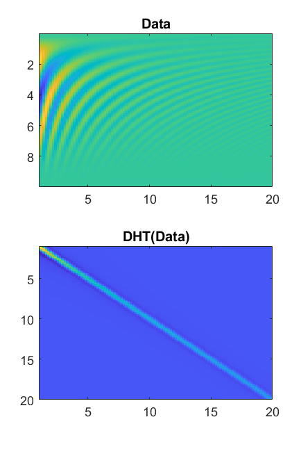

# Discrete-Hankel-Transform

The code follows a similar path of the Discrete Fourier transform (DFT), including properties such as orthogonality and invertibility, as well as the typical discrete shift, modulation, multiplication, and convolution rules. This is unlike past definitions of DHT that approximated the continuous integral transform without the properties mentioned.

This code is based on: Baddour, N. and Chouinard, U., 2017. Journal of Open Research Software, 5(1), p.4. [doi.org/10.5334/jors.82](https://doi.org/10.5334/jors.82)
 with a few improvements: The Y matrix code is now vectorized making it ~ x20 faster, there are optional zero padding and arrays support input similar to Matlab's FFT functionality, meaning that the Bessel zeros and Y matrix are only calculated once. The Bessel zeros calculation code uses the updated version by Jason Nicholson.

